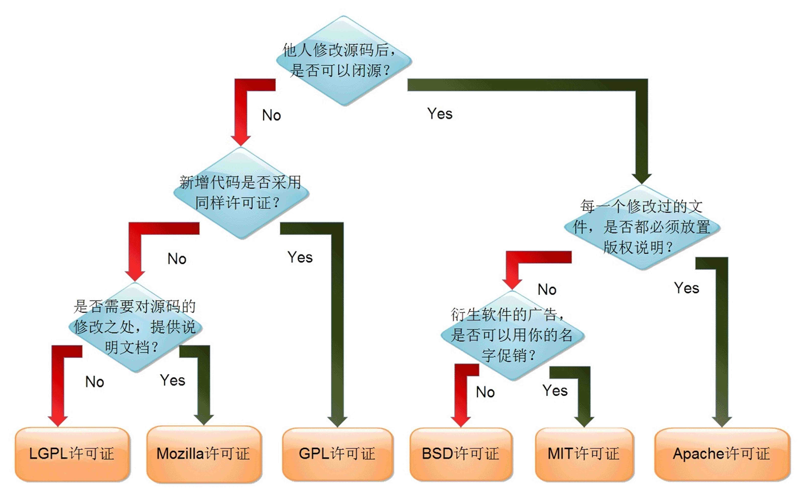

# 开源协议

Open Source License，开源软件源代码的著作权既没有被放弃也没有过期，其修改和发行等仍然要受到著作权法或者开源软件许可证的制约。

## GPL（GNU General Public License）

GPL是最常见和最具影响力的开源协议之一。它有多个版本，包括GPLv2和GPLv3。GPL要求任何基于或修改自GPL许可的软件的派生作品也必须以相同的协议分发。GPL保证了用户可以自由地使用、修改和分发软件，同时确保了这些自由权利在未来也不会被剥夺。

> 强著作权许可证，其派生作品只能以相同的许可条款分发，只要使用GPL协议的相关类库与代码，则该软件亦必须采用GPL协议，既必须开源与免费。

Linux内核：世界上最著名的开源项目，操作系统内核。
GCC（GNU Compiler Collection）：一套广泛使用的编译器集合。
GNU工具链：包括GNU Binutils、GDB调试器等工具。
GIMP（GNU Image Manipulation Program）：图像编辑和处理软件。
LibreOffice：办公套件，包括文档处理、电子表格、演示文稿等功能。

## MIT（Massachusetts Institute of Technology）

MIT许可证是一种非常宽松的开源协议。它允许自由地使用、修改和分发软件，无论是作为源代码还是作为编译后的二进制代码。作者只想保留版权，而无任何其他了限制，MIT许可证对派生作品的许可要求相对较少。

> 宽松许可证。使用者只需在发布的源代码、二进制可执行文件相关文档中包含MIT许可协议声明，便可自由的使用、修改源代码、作为商业软件再发布、甚至使用开源机构名字做产品的市场推广

Node.js：基于Chrome V8引擎构建的JavaScript运行时环境。
Ruby on Rails：基于Ruby语言的Web应用程序框架。
jQuery：JavaScript库，简化了客户端脚本编写。
React Native：用于构建跨平台移动应用的JavaScript框架。
Xamarin.Forms：用于创建跨平台移动应用的.NET开发工具。

## Apache Licence 2.0

Apache许可证也是一种宽松的开源协议。它允许自由地使用、修改和分发软件，并包括对专利权的明确授权。Apache许可证还包括对专利权的明确授权，使得使用该软件的用户不会因为专利纠纷而受到影响。Apache许可证对派生作品的许可要求相对较少。

> 宽松许可证。允许代码修改、再发布。使用者也可以在需要的时候修改代码来满足需要并作为开源或商业产品发布/销售。

前提条件

- 需要给使用代码的用户拷贝一份Apache Licence
- 如果你修改了代码，需要再被修改的文件中说明。
- 在延伸的代码中（修改和有源代码衍生的代码中）需要带有原来代码中的协议，商标，专利声明和其他原来作者规定需要包含的说明。
- 如果再发布的产品中包含一个Notice文件，则在Notice文件中需要带有Apache Licence。你可以在Notice中增加自己的许可，但不可以表现为对Apache Licence构成更改。

你可以在Notice中增加自己的许可，但不可以表现为对Apache Licence构成更改。

Apache HTTP服务器：世界上最流行的Web服务器软件。
Hadoop：用于分布式存储和处理大规模数据集的开源框架。
Tomcat：Java Servlet和JavaServer Pages (JSP)容器。
Cassandra：分布式数据库系统，用于处理大规模数据集。
Kafka：高性能、可扩展的分布式消息队列系统。

## BSD许可证

BSD许可证是一系列类似的许可证，如BSD 2-Clause License和BSD 3-Clause License。BSD许可证也是一种宽松的许可证，允许自由地使用、修改和分发软件。与MIT和Apache许可证类似，BSD许可证没有要求派生作品必须使用相同的许可证进行分发，BSD许可证对派生作品的许可要求相对较少。

> 宽松许可证。可以自由的使用、修改源代码，也可以将修改后的代码开源或闭源，甚至作为商业软件再发布。前提是发布的源代码、二进制可执行文件相关文档中需包含BSD许可协议声明，并且不能使用开源机构名字做产品的市场推广。

### 使用BSD前提条件

当你发布使用了BSD协议的代码，或以BSD协议代码为基础做二次开发时，需要满足以下三个条件：

- 如果再发布的产品中包含源代码，则在源代码中必须带有原来代码中的BSD协议；
- 如果再发布的是二进制类库/软件，则需要在类库/软件的文档和版权声明中包含原来代码中的BSD协议；
- 不可以使用开源代码的作者/机构名字和原来产品的名字做市场推广；

BSD 鼓励代码共享，但需要尊重代码作者的著作权。

BSD允许使用者修改和重新发布代码，也允许基于BSD代码上开发商业软件的发布和销售，因此很多公司企业在选用开源产品的时候都首选BSD协议（因为遵循BSD协议的代码完全可控，必要的时候可以修改或者二次开发）。

FreeBSD：基于BSD操作系统的自由和开放源代码的操作系统。
NetBSD：可移植的操作系统，具有高度可扩展性。
OpenBSD：注重安全性的自由和开放源代码的操作系统。
PostgreSQL：关系型数据库管理系统。
Nginx：高性能的Web服务器和反向代理服务器。

## MPL Mozilla公共许可证（Mozilla Public License，MPL）

MPL是一种相对较为复杂的开源协议，适用于涉及Mozilla项目的软件。MPL要求对源代码的修改必须以MPL或兼容协议进行分发，但对于以MPL许可的原始代码的直接使用并没有强制要求。

Mozilla Firefox：自由和开放源代码的Web浏览器。
Thunderbird：自由和开放源代码的电子邮件和新闻客户端。
Rust：系统级编程语言，注重安全性和并发性。
VLC媒体播放器：跨平台的多媒体播放器和流媒体服务器。

## LGPL（Lesser General Public License）

LGPL原本被称为GNU Library General Public License，最初于1991年发布，为与GPLv2保持一致而采用2.0版的编号；
许可证的2.1版与1999年在修订后发布，与此同时，它被重命名为GNU Lesser General Public License，以显示自由软件基金会（Free Software Foundation）认为并不是所有程序库都应当采用该许可证的态度；
LGPL的第3版于2007年发布，它以在GPL第3版之上附加应用一系列许可的方式表现。

> LGPL允许商业软件通过类库引用方式使用LGPL类库而不需要开源商业软件的代码，这使得采用LGPL协议的开源代码可以被商业软件作为类库引用并发布和销售；但使用者如果修改了LGPL协议的代码或衍生，则所有修改的代码和衍生的代码都必须采用LGPL协议。

## Mozilla（Mozilla Public License）

Mozilla开源协议由Mozilla基金会开发并维护。
该协议融合了BSD许可与GNU通用公共许可协议的特性，追求平衡专有软件和开源软件开发者之间的顾虑（平衡开发者对源代码的需求和他们利用源代码获得的利益）。

> 允许使用者在自己已有的源代码库上加一个接口，除了对接Mozilla Public License开源库的接口程序源代码以MPL许可的形式对外许可外，源代码中的其他源码可以不用MPL许可证的方式强制对外许可。

使用BSD前提条件：

- 经MPL许可证发布的源代码的修改也要以MPL许可证的方式再许可出来；
- 如果修改了代码，需要有一个专门文件描述对源代码程序的修改时间和修改方式；
